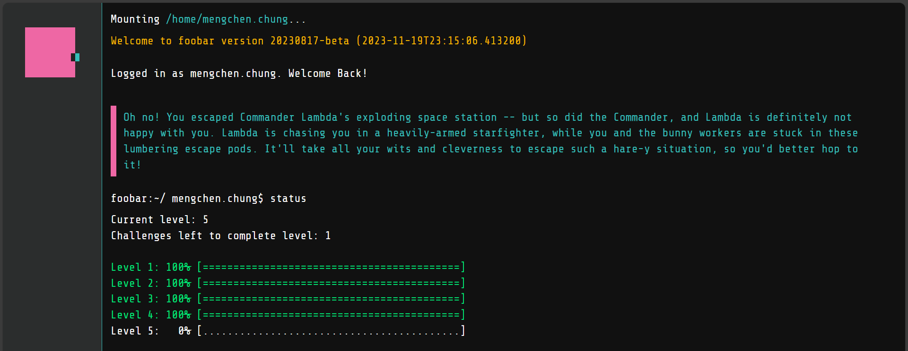

# Google Foobar Challenge
My journey on solving Google Foobar

## What is Google Foobar? 
I recommend checking out this post: https://www.turing.com/kb/foobar-google-secret-hiring-technique. It clearly explains this challenge in all its aspects, along with some urban tales.

## Disclaimer
I shared the solutions to document my thoughts and offer my insights. There are also many other solutions available online. However, if you're currently facing the challenge, you might prefer to solve and enjoy the game on your own.

## How did I get the invite? 
I had been searching for advanced Python syntaxes and designs, as well as AI applications. I vividly recall one afternoon when I was looking for articles on Contrastive Divergence (CD), and the browser suddenly displayed a UI with a message like 'You've been looking for some interesting stuff; we have a game for you. Do you want to play?' That's when I started my journey down the rabbit hole.

## How does it look? 
It consists of five levels, each with 1, 2, 3, 2, and 1 questions, respectively. The entire game is set in a shell sandbox, so we navigate through it using the command line. Before submission, we can verify your solution with the 'verify' command, which will run ten test cases on your solution. Once submitted, the folder for that question disappears. The challenge accepts solutions in either Java or Python, with a note that it uses Python 2.7.10 instead of the more popular Python 3. Therefore, it's essential to remember key differences between the two Python generations to avoid unexpected errors.

## What happens after each level? (Spoiler Alert)
**Level 1:** We'll witness a bunny jumping left and right on the screen—kind of adorable, right? Well, hold onto that thought until encountering the bunny question later lol.

**Level 2:** We'll receive an invitation link that we can share with one other person.

**Level 3:** We'll get to share our contact information with a Google recruiter.

**Level 4:** We'll receive another invitation link.

**Level 5:** We'll encounter an encrypted message.

